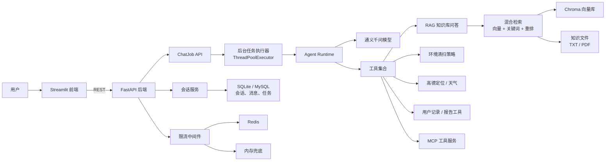
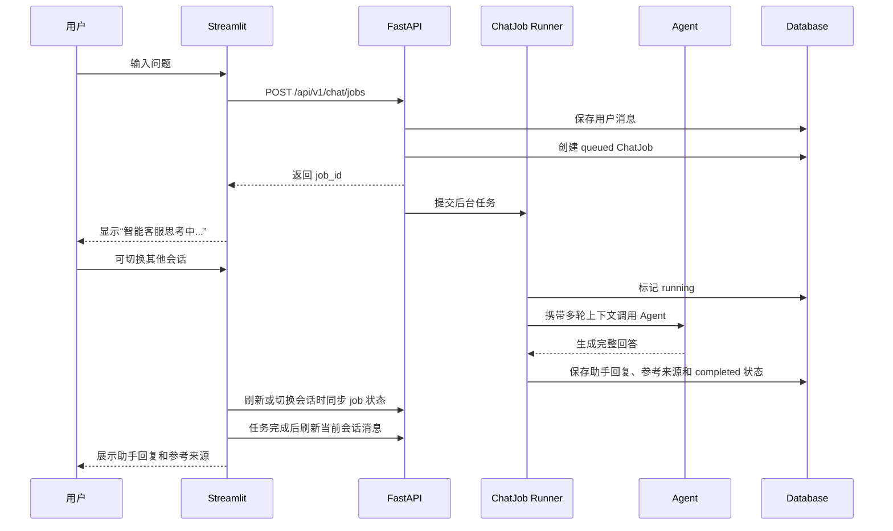
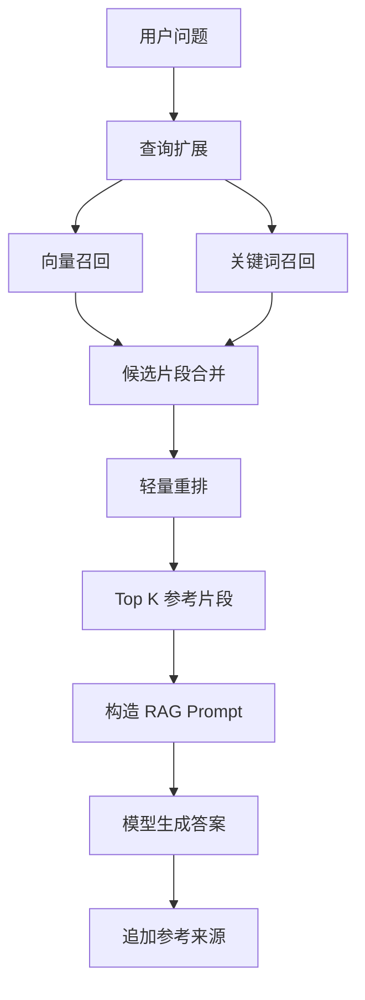
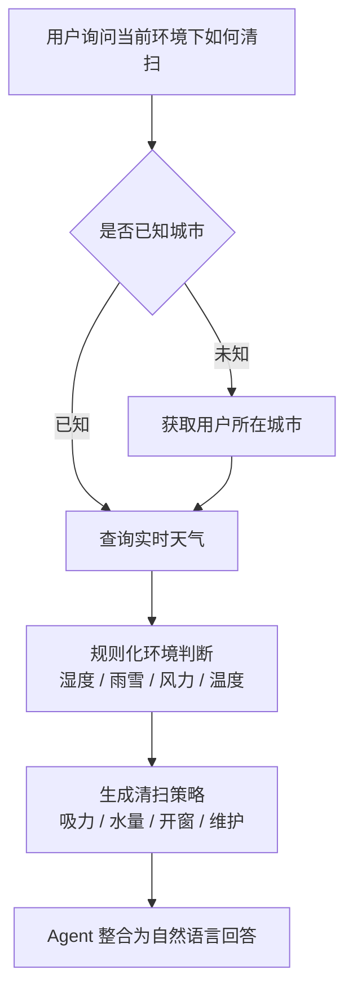

# 洁境智顾 Agent

面向智能清洁设备场景的环境感知 RAG Agent 智能客服系统。项目聚焦扫地机器人、扫拖一体机等设备的售前咨询、故障排查、维护保养、环境清扫策略和使用报告查询，支持知识库问答、多轮会话、历史持久化、后台并行生成、参考来源追溯、MCP 工具服务和企业级后端 API。

这个项目不是通用闲聊机器人，而是一个围绕具体业务场景设计的 AI 应用系统。用户可以连续追问设备问题，系统会结合知识库、用户使用记录、当前位置、实时天气和清洁策略，给出可解释、可追溯的回答。

## 项目亮点

- 垂直场景 Agent：围绕智能清洁设备构建知识库、业务工具和环境策略，不依赖固定问答模板。
- 企业级前后端分离：Streamlit 负责交互界面，FastAPI 提供 RESTful API、会话管理和后台任务能力。
- 后台并行会话生成：通过 `ChatJob` 机制将 Agent 回复放入后台执行，用户可以在某个会话生成中切换到其他会话，不会中断原任务。
- 多轮会话持久化：支持会话新建、切换、删除、清空、刷新恢复和历史记录保存。
- RAG 知识库问答：基于 Chroma 构建向量库，结合向量召回、关键词召回和轻量重排。
- 可追溯回答：助手回复支持参考来源展开，展示来源文件、片段预览、召回通道和重排分。
- 环境感知策略：接入高德定位与天气服务，将天气、湿度、风力等信息转化为吸尘、拖地、开窗和维护建议。
- MCP 工具服务：将 RAG、天气、环境策略和用户记录能力暴露为 MCP 工具，便于外部 Agent 调用。
- 稳定性设计：接口限流优先使用 Redis，Redis 不可用时自动降级为内存限流。
- 工程化交付：提供 Docker Compose、自动化测试、评测脚本、API 文档和演示路线。

## 技术栈

| 层级 | 技术 |
|---|---|
| 前端 | Streamlit、固定标题栏、自定义侧栏控制、会话状态同步 |
| 后端 | FastAPI、Pydantic、RESTful API、SSE 兼容接口 |
| 并行任务 | `ChatJob`、`ThreadPoolExecutor`、任务状态持久化 |
| Agent | LangChain / LangGraph 风格工具调用、ReAct 思路 |
| 大模型 | DashScope / 通义千问 |
| Embedding | DashScope Embeddings |
| RAG | Chroma、混合检索、轻量重排、参考来源追溯 |
| 数据库 | SQLite，兼容 MySQL 连接配置 |
| 服务治理 | Redis 限流、内存降级、结构化日志 |
| 工具协议 | MCP |
| 测试 | pytest、FastAPI TestClient |
| 部署 | Docker、Docker Compose |

## 系统架构



## 核心流程

### 企业级并行会话流程



### RAG 检索流程



### 环境清扫策略流程



## 目录结构

```text
api/            # FastAPI 后端：会话、消息、ChatJob、限流、运维接口
agent/          # Agent 编排与工具定义
rag/            # 向量库、混合检索、RAG 总结服务
utils/          # 配置、日志、路径、高德客户端、后端客户端
config/         # YAML 配置
data/           # 知识库文件、业务样例数据、本地 SQLite 数据
eval/           # RAG 评测脚本与评测数据
prompts/        # 主提示词、RAG 提示词、报告提示词
tests/          # 自动化测试
app.py          # Streamlit 前端入口
mcp_server.py   # MCP 工具服务入口
docker-compose.yml
```

## 本地启动

### 1. 安装依赖

```bash
cd /Users/xujiajin/Desktop/RAG-Agent/代码/智扫通Agent
python3 -m venv .venv
source .venv/bin/activate
pip install -r requirements.txt
cp .env.example .env
```

### 2. 配置环境变量

至少需要配置：

```bash
export DASHSCOPE_API_KEY="你的DashScope Key"
export AMAP_WEB_SERVICE_KEY="你的高德Web服务Key"
```

推荐后端模式配置：

```bash
export ZST_BACKEND_URL="http://localhost:8000"
export DATABASE_URL="sqlite:///./data/zst_enterprise.db"
export REDIS_URL="redis://localhost:6379/0"
export API_RATE_LIMIT_PER_MINUTE=60
export CHAT_JOB_MAX_WORKERS=4
export ZST_USER_ID=1001
export ZST_USER_LOCATION="南京"
```

说明：

- `DASHSCOPE_API_KEY` 用于通义千问模型调用和 Embedding。
- `AMAP_WEB_SERVICE_KEY` 用于高德 IP 定位和实时天气，需创建“Web服务”类型 Key。
- `ZST_BACKEND_URL` 配置后，Streamlit 前端会优先调用 FastAPI 后端。
- `DATABASE_URL` 默认使用 SQLite，也可以替换为 MySQL 连接。
- `REDIS_URL` 用于接口限流；Redis 不可用时会自动降级为内存限流。
- `CHAT_JOB_MAX_WORKERS` 控制后台并行生成任务数量。
- `ZST_USER_LOCATION` 可固定演示城市，例如 `南京` 或 `南京市`。

### 3. 启动 Redis

如果本机已安装 Redis：

```bash
redis-server
```

如果暂时不启动 Redis，系统仍可运行，限流会自动降级为内存模式。

### 4. 启动后端 API

请在项目根目录执行：

```bash
uvicorn api.main:app --host 0.0.0.0 --port 8000 --reload
```

API 文档地址：

```text
http://localhost:8000/docs
```

### 5. 启动前端

后端模式：

```bash
ZST_BACKEND_URL=http://localhost:8000 streamlit run app.py
```

本地兜底模式：

```bash
streamlit run app.py
```

前端地址：

```text
http://localhost:8501
```

## Docker 启动

```bash
docker compose up --build
```

默认服务：

| 服务 | 地址 |
|---|---|
| Streamlit 前端 | http://localhost:8501 |
| FastAPI 后端 | http://localhost:8000 |
| Redis | localhost:6379 |

## MCP 工具服务

项目提供独立 MCP 服务入口，可将核心能力暴露给支持 MCP 的客户端或外部 Agent。

启动方式：

```bash
python mcp_server.py
```

当前 MCP 工具：

| 工具 | 说明 |
|---|---|
| `get_user_location` | 获取当前用户所在城市 |
| `get_weather` | 查询指定城市实时天气 |
| `get_cleaning_environment_advice` | 生成环境清扫策略 |
| `rag_search` | 检索并总结智能清洁设备知识库 |
| `get_available_usage_months` | 获取用户可查询月份 |
| `get_latest_usage_record` | 获取用户最近一期使用记录 |
| `get_usage_record` | 获取用户指定月份使用记录 |
| `get_usage_profile` | 获取用户画像摘要 |

## 演示说明

### 演示准备

1. 启动 Redis、FastAPI 后端和 Streamlit 前端。
2. 确认环境变量已配置 `DASHSCOPE_API_KEY` 和 `AMAP_WEB_SERVICE_KEY`。
3. 打开 `http://localhost:8501`。
4. 如需固定定位到南京，可以设置 `ZST_USER_LOCATION=南京`。

### 演示路线 1：RAG 知识库问答

推荐提问：

```text
扫地机器人回充失败怎么办？
```

期望展示：

- 系统根据知识库回答故障排查建议。
- 回答末尾包含 `参考：`。
- 助手消息下方可以展开“参考来源”。
- 参考来源展示文件名、片段、召回通道和重排分。

### 演示路线 2：实时定位与环境清扫策略

推荐提问：

```text
我当前位置的天气适合使用扫地机器人吗？
```

期望展示：

- Agent 获取当前位置或使用 `ZST_USER_LOCATION`。
- 调用高德天气服务查询实时环境。
- 将天气、湿度、风力等信息转成吸尘、拖地水量、开窗和维护建议。

### 演示路线 3：并行会话生成

推荐操作：

1. 在会话 A 中提问一个需要较长时间回答的问题。
2. 看到“智能客服思考中...”后，切换到会话 B。
3. 在会话 B 继续查看或提问。
4. 切回会话 A，等待回答完成。

期望展示：

- 会话 A 的后台任务不会因为切换会话被中断。
- 前端不会刻意显示“后台生成中”字样，只保持自然的思考中外观。
- 任务完成后，回答和参考来源会写入对应会话。

### 演示路线 4：历史持久化

推荐操作：

1. 新建一个会话。
2. 连续问两个相关问题。
3. 切换到另一个会话。
4. 再切回原会话。
5. 刷新页面后确认历史消息仍存在。

期望展示：

- 侧边栏可以管理多个会话。
- 多轮上下文不会因为刷新页面丢失。
- 用户消息和助手回复都已持久化。

### 演示路线 5：知识库重建

推荐操作：

1. 修改或新增 `data/` 下的知识文件。
2. 点击侧边栏“重建知识库”。
3. 重新提问与新增内容相关的问题。

期望展示：

- 系统能够重新构建向量库。
- Agent 重载后可以检索新的知识片段。

## 关键 API

| 方法 | 路径 | 说明 |
|---|---|---|
| GET | `/api/v1/health` | 健康检查 |
| GET | `/api/v1/sessions` | 查询会话列表 |
| POST | `/api/v1/sessions` | 创建会话 |
| GET | `/api/v1/sessions/{session_id}` | 查询会话详情 |
| GET | `/api/v1/sessions/{session_id}/messages` | 查询会话消息 |
| DELETE | `/api/v1/sessions/{session_id}` | 删除会话 |
| DELETE | `/api/v1/sessions/{session_id}/messages` | 清空会话消息 |
| POST | `/api/v1/chat/jobs` | 创建后台聊天任务，推荐前端使用 |
| GET | `/api/v1/chat/jobs/active` | 查询 queued/running 任务 |
| GET | `/api/v1/chat/jobs/{job_id}` | 查询单个任务状态 |
| POST | `/api/v1/chat/stream` | SSE 流式聊天兼容接口 |
| POST | `/api/v1/admin/knowledge/rebuild` | 重建知识库 |
| POST | `/api/v1/admin/agent/reload` | 重载 Agent |

## 测试与评测

运行自动化测试：

```bash
pytest -q
```

当前测试覆盖：

- FastAPI 健康检查和会话 CRUD
- ChatJob 创建、查询和活跃任务列表
- 项目配置和路径检查
- 高德天气与环境策略关键逻辑
- RAG 评测数据 schema

运行 RAG 评测：

```bash
python eval/run_eval.py
python eval/run_eval.py --with-answer-eval
```

评测输出：

```text
eval/metrics_report.md
eval/metrics_details.json
```

## 常见问题

### 1. `ModuleNotFoundError: No module named 'api'`

通常是因为没有在项目根目录启动后端。请先进入项目目录：

```bash
cd /Users/xujiajin/Desktop/RAG-Agent/代码/智扫通Agent
uvicorn api.main:app --host 0.0.0.0 --port 8000 --reload
```

### 2. Redis 连接失败怎么办？

可以启动 Redis：

```bash
redis-server
```

也可以暂时不启动，系统会自动降级为内存限流。

### 3. 高德返回 `INVALID_USER_KEY`

常见原因：

- `AMAP_WEB_SERVICE_KEY` 没有配置到当前终端环境。
- Key 类型不是“Web服务”。
- Key 配置后没有重启 FastAPI / Streamlit。
- 修改的是 `.env.example`，但运行时没有加载到 `.env` 或环境变量。

### 4. 修改数据库模型后旧 SQLite 不生效

如果本地旧数据库中没有新表，可以删除本地开发库后重启后端：

```bash
rm data/zst_enterprise.db
uvicorn api.main:app --host 0.0.0.0 --port 8000 --reload
```

注意：删除数据库会清空本地会话历史。
